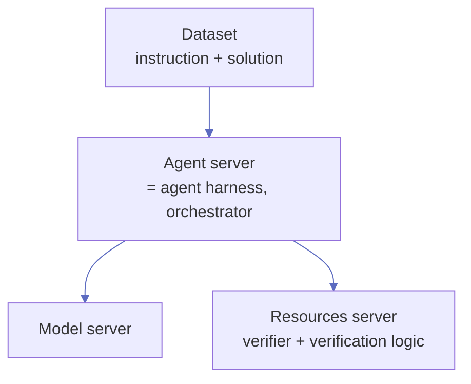
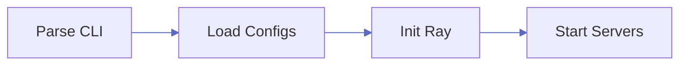
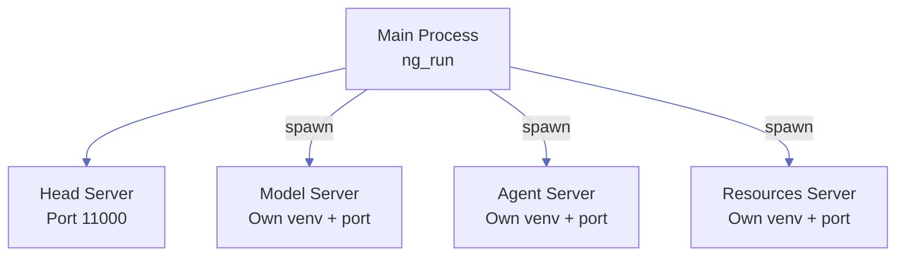
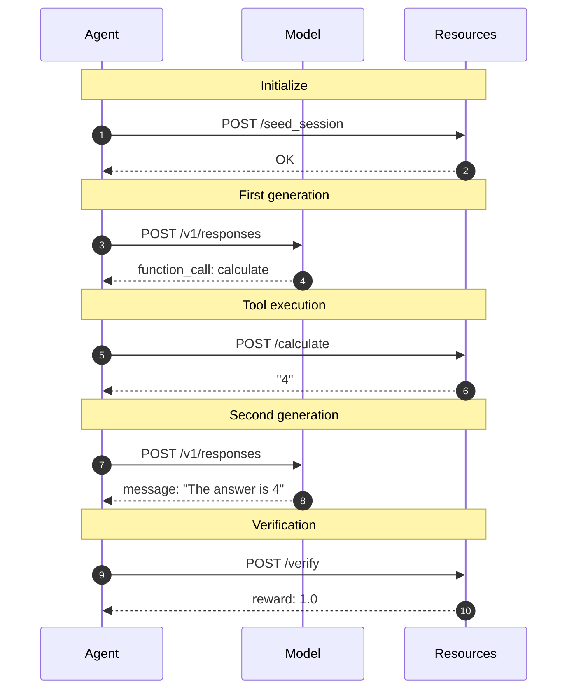
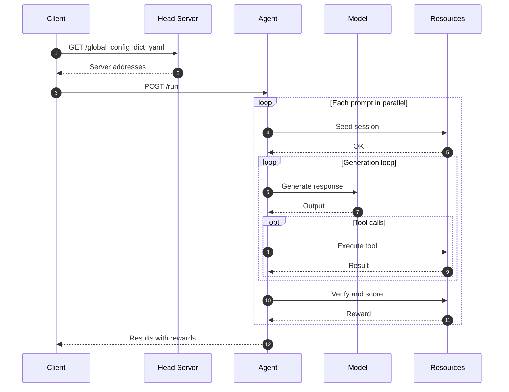

NeMo Gym separates an agentic environment into four components that you vary independently — the dataset, the agent harness, the model, and the reward verifier. Most frameworks bundle these together at the task level. Gym keeps them as separate servers so you can swap any one of them without rewriting the others.

## The four components



| Component | Role | Implements |
| --- | --- | --- |
| **Dataset** | One task per JSONL line: instruction (input messages) and solution (verifier metadata). The 4th component, peer to the three servers. | JSONL file referenced from the agent config |
| **Agent server** (the agent harness) | Orchestrator. Runs the model + tools loop and routes the final output to the verifier. | `responses()`, `run()` |
| **Model server** | Stateless LLM inference. No memory, no orchestration. | `chat_completions()`, `responses()` |
| **Resources server** | Verifier, verification logic, and any task-specific tools, sandboxes, or environment state. Returns reward in `[0, 1]`. | `verify()` and any tool endpoints |

### Dataset (the 4th component)

A JSONL file with one task per line. Each line carries the prompt the agent sees and the metadata the verifier needs:

```json
{
  "responses_create_params": {
    "input": [
      {"role": "system", "content": "..."},
      {"role": "user", "content": "..."}
    ]
  },
  "verifier_metadata": { "expected_answer": "..." }
}
```

`responses_create_params.input` follows the OpenAI message format. `verifier_metadata` is opaque to the framework — define whatever fields your benchmark needs (test cases, expected answers, task IDs) and they pass through to the resources server's `verify()`.

Datasets are referenced from agent configs by `jsonl_fpath`. Train and validation datasets live in the GitLab dataset registry; example datasets (5 entries for smoke testing) are committed to git in `data/example.jsonl`.

### Agent server — the agent harness

The agent server (the agent harness) is the orchestrator. It receives a prompt, calls the model, dispatches any tool calls to the resources server, and returns the verified reward. It does not run an LLM itself — all generation goes to the model server.

NeMo Gym ships several agent servers:

- `simple_agent` — single-turn, the default; works for most benchmarks.
- `proof_refinement_agent` — multi-turn correction loop where the model sees error feedback and retries.
- `verifiers_agent`, `swe_agents`, and others — task-shaped harnesses for specific benchmark families.

Pick a harness when you wire up your YAML config; refer to the [Agent server](/latest/agent-server) reference for the full list.

### Model server

A stateless `/v1/responses` (and `/v1/chat/completions`) endpoint. It receives a conversation and returns the model's next output — text, tool calls, or code — with no memory.

Four variants ship with NeMo Gym:

- `openai_model` — endpoints supporting `/v1/responses`.
- `azure_openai_model` — Azure-hosted OpenAI models.
- `vllm_model` — remote vLLM endpoint exposing `/v1/chat/completions`.
- `local_vllm_model` — vLLM started in-process by NeMo Gym.

### Resources server

The resources server owns the environment side of the rollout: tools the agent can call, any sandboxes or external state, and the `verify()` method that scores the final output. Per-rollout state is isolated via session cookies, so concurrent rollouts don't bleed into each other.

`verify()` receives the model output and the row's `verifier_metadata`, and returns a `BaseVerifyResponse` whose `reward` field lives in `[0, 1]`. Subclasses can carry richer fields (per-test breakdowns, traces, judge rationales) — the framework only requires `reward`.

## Why separate them

Separating dataset, harness, model, and verifier means each axis varies on its own:

- **Vary the prompt** — edit one dataset file. No code changes.
- **Vary the harness** — swap the agent server in YAML. Same dataset, same model, new orchestration shape.
- **Vary the model** — swap the model server URL. Useful for instruct-vs-thinking comparisons or for rolling out a new checkpoint.
- **Vary the verifier** — swap the resources server. Run the same task through a strict scorer and an LLM-as-judge scorer side-by-side.

Frameworks that bundle these at the task level force you to edit every task whenever any axis changes. Gym keeps them orthogonal.

## Inter-server communication

All servers talk over HTTP via aiohttp. There is no shared memory.

- **`ServerClient`** wraps aiohttp with retry logic — 3 tries, exponential backoff. The global aiohttp client is a singleton with connection pooling.
- **Session cookies** propagate through the call stack so stateful resources servers can pin tool calls and verification to a single rollout.
- **OpenAI API compatibility** — model servers expose `/v1/responses`, so any OpenAI-compatible client can talk to them.
- **uvicorn + FastAPI** — every server is a FastAPI app served by [uvicorn](https://uvicorn.dev/).

## Control plane: server startup

When you run `ng_run`, the system starts up in four phases:



### Phase 1: Parse CLI

`ng_run` uses Hydra to parse command-line arguments. Specify configuration files via `+config_paths`:

```bash
ng_run "+config_paths=[resources_servers/math/configs/math.yaml, responses_api_models/openai_model/configs/openai_model.yaml]"
```

### Phase 2: Load and merge configs

Configuration is loaded from multiple sources in order of priority (later sources override earlier):

1. YAML files specified in `config_paths`
2. Local `env.yaml` file (for sensitive values like API keys)
3. Command-line arguments (highest priority)

**Port allocation**: You can explicitly specify `host` and `port` in your config. If not provided, the framework allocates ports from available system ports and tracks used ports to prevent conflicts.

### Phase 3: Initialize Ray

The system initializes a Ray cluster for distributed coordination. If `ray_head_node_address` is specified in the config, it connects to an existing cluster; otherwise, it starts a new one.

### Phase 4: Start servers

Servers are started in two stages:



1. **Head Server**: Started as a background thread in the main process. Provides endpoints for config discovery (`/global_config_dict_yaml`) and server instance listing (`/server_instances`).
2. **Server Subprocesses**: Each configured server is spawned as an independent OS process.
   - Each server has its own Python virtual environment to isolate dependencies.
   - Each runs uvicorn with a FastAPI application listening on `http://{host}:{port}`.
   - The global config is passed via environment variable `NEMO_GYM_CONFIG_DICT`.
   - The specific server identity is passed via `NEMO_GYM_CONFIG_PATH`.
   - Server URLs are registered in the global config so other servers can discover and call them.
3. **Health Check**: The main process polls each server's HTTP endpoint until all return 200, then reports "All servers ready!"

### Running state

Once all servers are healthy, the system enters steady state:

- The main process sleeps and periodically polls subprocess health.
- Each server process runs its own uvicorn event loop, handling requests asynchronously.
- Servers communicate with each other only via HTTP (no shared memory).
- Session state is maintained via cookies for multi-step rollouts.

### Shutdown

When you press Ctrl+C (or the process receives SIGINT):

1. SIGINT is forwarded to all server subprocesses.
2. The main process waits for subprocesses to terminate (with timeout).
3. The head server thread is stopped.
4. The process exits cleanly.

## HTTP request flow

During a single rollout, servers communicate via HTTP. This example shows a math problem with one tool call:



## Data plane: rollout collection

When you run `ng_collect_rollouts`, the system collects training data by executing rollouts in parallel:



The client first queries the Head Server to discover server addresses from the global config, then reads input JSONL and dispatches prompts to the agent. Completed rollouts are written to output JSONL.

**Concurrency behavior differs by use case:**

- **Standalone rollout collection** (`ng_collect_rollouts`): A semaphore gates concurrency via `num_samples_in_parallel` to control load.
- **Training framework integration** (e.g., NeMo RL): All requests are sent without gating; the training framework manages concurrency externally.

## Implementation: how the framework code organizes the four components

The four-component model is the user-facing mental model. Underneath, the framework codifies it as a Pydantic + FastAPI base class hierarchy:

```
BaseServer
└── SimpleServer
    ├── SimpleResourcesServer        # implement verify()
    ├── SimpleResponsesAPIModel      # implement chat_completions(), responses()
    └── SimpleResponsesAPIAgent      # implement responses(), run()
```

- `BaseServer` carries the Pydantic config and the `ServerClient` used to call other servers.
- `SimpleServer` adds the FastAPI app and middleware stack.
- The three subclasses correspond to the three server roles. The dataset (the 4th component) is plain JSONL — no class needed.

A `HeadServer` coordinates lifecycles, config, and Ray cluster init across the three server processes.

## Where to next

- [Configuration](/latest/about/concepts/configuration) — how YAML configs map to running servers.
- [Task verification](/latest/about/concepts/task-verification) — how `verify()` returns reward and what `BaseVerifyResponse` carries.
- [Key terminology](/latest/about/concepts/key-terminology) — canonical definitions for agent harness, environment, task, dataset.
- [Agent server reference](/latest/agent-server) — the agent harnesses that ship with NeMo Gym.
- [Resources server reference](/latest/resources-server) — verifier and tool implementation details.
- [Build environments](/latest/environment-tutorials) — wire up a dataset, harness, model, and verifier from scratch.
