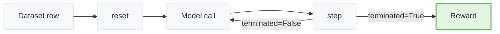

You ran [`blackjack`](https://github.com/NVIDIA-NeMo/Gym/tree/main/resources_servers/blackjack) end-to-end in the [Quickstart](/latest/get-started/quickstart). Now you'll build a stripped-down version of it — **MiniBlackjack** — in about 30 lines of Python. Same [`GymnasiumServer`](https://github.com/NVIDIA-NeMo/Gym/tree/main/resources_servers/gymnasium) shape (`reset()` / `step()`); only one decision per hand instead of looping hits.

<Card>

**Goal**: Build and run a minimal `GymnasiumServer` environment end-to-end.

**Steps:**

1. Subclass `GymnasiumServer` and implement `reset()` / `step()`.
2. Wire the environment to a `gymnasium_agent` with YAML.
3. Author the JSONL dataset that drives rollouts.
4. Run the env and read the agent's reward from `ng_reward_profile`.

</Card>

## Prerequisites

1. Completed the [Quickstart](/latest/get-started/quickstart) (you've run Blackjack end-to-end).
2. NeMo Gym virtual environment activated.
3. `env.yaml` configured (refer to [Configuration](/latest/get-started/configuration)).

<Tip>
**Time**: about 15 minutes, including the rollout run.
</Tip>

## Concepts Overview

Every Gymnasium-style environment in NeMo Gym is a class with two methods. The agent server calls them in a loop:



| Method | Returns | Purpose |
| --- | --- | --- |
| `reset(metadata, session_id)` | `(observation, info)` | Set up per-rollout state; return the first message to the model |
| `step(action, metadata, session_id)` | `(observation, reward, terminated, truncated, info)` | Score the response. Non-`None` `observation` continues the episode; `None` + `terminated=True` ends it |
| `self.session_state` | `dict` | Per-rollout state storage on `GymnasiumServer` |

<Note title="See Also">
For multi-step, tool-calling, and LLM-as-judge patterns, refer to the [Gymnasium API reference](https://github.com/NVIDIA-NeMo/Gym/tree/main/resources_servers/gymnasium).
</Note>

## Tutorial Steps

### Scaffold the Files

1. **Create the directory tree**:

   ```bash
   mkdir -p resources_servers/mini_blackjack/{configs,data}
   ```

   Final layout:

   ```text
   resources_servers/mini_blackjack/
   ├── app.py
   ├── configs/mini_blackjack.yaml
   ├── data/example.jsonl
   └── requirements.txt
   ```

2. **Add `requirements.txt`**:

   ```text
   -e nemo-gym[dev] @ ../../
   ```

`ls resources_servers/mini_blackjack/` should now list the scaffold directories.

### Implement the Environment

Write `resources_servers/mini_blackjack/app.py`. Each rollout: deal a hand worth 12-20, the model picks `<action>hit</action>` or `<action>stand</action>`, score against a fixed dealer hand of 17.

```python
import random
import re
from typing import Optional

from nemo_gym.openai_utils import NeMoGymResponse
from resources_servers.gymnasium import GymnasiumServer, extract_text


class MiniBlackjackEnv(GymnasiumServer):
    async def reset(self, metadata: dict, session_id: Optional[str] = None) -> tuple[Optional[str], dict]:
        rng = random.Random()
        player = rng.randint(12, 20)
        self.session_state[session_id] = {"player": player, "rng": rng}
        return (
            f"Your hand is worth {player}. Dealer stands on 17. "
            "Respond with <action>hit</action> or <action>stand</action>."
        ), {}

    async def step(
        self, action: NeMoGymResponse, metadata: dict, session_id: Optional[str] = None
    ) -> tuple[Optional[str], float, bool, bool, dict]:
        state = self.session_state[session_id]
        text = extract_text(action)
        m = re.search(r"<action>\s*(hit|stand)\s*</action>", text, re.IGNORECASE)
        decision = m.group(1).lower() if m else "stand"

        player = state["player"]
        if decision == "hit":
            player += state["rng"].randint(2, 11)

        if player > 21:
            reward, result = -1.0, "bust"
        elif player > 17:
            reward, result = 1.0, "beat dealer"
        elif player == 17:
            reward, result = 0.0, "push"
        else:
            reward, result = -1.0, "lost to dealer"

        return None, reward, True, False, {"final": player, "result": result}


if __name__ == "__main__":
    MiniBlackjackEnv.run_webserver()
```

`reset()` returns the hand description; `step()` parses the action tag, settles against a fixed-17 dealer, and terminates with `+1`, `0`, or `-1`.

### Wire the Configuration and Dataset

1. **Add the config** at `resources_servers/mini_blackjack/configs/mini_blackjack.yaml`:

   ```yaml
   mini_blackjack:
     resources_servers:
       mini_blackjack:
         entrypoint: app.py
         domain: games
         verified: false

   mini_blackjack_gymnasium_agent:
     responses_api_agents:
       gymnasium_agent:
         entrypoint: app.py
         resources_server:
           type: resources_servers
           name: mini_blackjack
         model_server:
           type: responses_api_models
           name: policy_model
         max_steps: 1
         datasets:
         - name: example
           type: example
           jsonl_fpath: resources_servers/mini_blackjack/data/example.jsonl
   ```

2. **Add the example dataset** at `resources_servers/mini_blackjack/data/example.jsonl`. One JSON object per line — duplicate the row below five times so the agent plays five hands.

   <Accordion title="Show the JSONL row">
   ```json
   {"responses_create_params": {"input": [{"role": "system", "content": "You are playing Blackjack. Decide whether to hit or stand based on your hand."}, {"role": "user", "content": "Deal me in."}]}, "agent_ref": {"type": "responses_api_agents", "name": "mini_blackjack_gymnasium_agent"}}
   ```
   </Accordion>

`wc -l resources_servers/mini_blackjack/data/example.jsonl` should return 5.

### Run and Verify

Same three commands you ran in the [Quickstart](/latest/get-started/quickstart), pointed at your new env.

1. **Start the servers** (Terminal 1):

   ```bash
   ng_run "+config_paths=[\
   resources_servers/mini_blackjack/configs/mini_blackjack.yaml,\
   responses_api_models/openai_model/configs/openai_model.yaml]"
   ```

2. **Collect rollouts** (Terminal 2):

   ```bash
   mkdir -p results
   ng_collect_rollouts \
       +agent_name=mini_blackjack_gymnasium_agent \
       +input_jsonl_fpath=resources_servers/mini_blackjack/data/example.jsonl \
       +output_jsonl_fpath=results/mini_blackjack_rollouts.jsonl \
       +num_repeats=4
   ```

3. **Read the win rate**:

   ```bash
   ng_reward_profile \
       +materialized_inputs_jsonl_fpath=results/mini_blackjack_rollouts_materialized_inputs.jsonl \
       +rollouts_jsonl_fpath=results/mini_blackjack_rollouts.jsonl
   ```

A `mean/reward` line prints. A reasonable strategy (stand on 17+, hit on 12-16) lands near `0.0` to `+0.3`; a model that always hits busts often and lands negative.

## Summary

**You completed:**

- ✅ Subclassed `GymnasiumServer` with `reset()` / `step()`
- ✅ Wired the environment to `gymnasium_agent` with YAML
- ✅ Authored a JSONL dataset and ran rollouts end-to-end

**Learn more:** [Resources Server](/latest/reference/servers/resources) · [Agent Server](/latest/reference/servers/agent) · [Task Verification](/latest/about/concepts/task-verification)

## Next Steps

<Cards>

<Card title="Read blackjack/app.py" href="https://github.com/NVIDIA-NeMo/Gym/tree/main/resources_servers/blackjack">
The full multi-step Blackjack you ran in Quickstart. Same shape, plus dealer logic and ace handling.

<Badge minimal outlined>example</Badge>
</Card>

<Card title="Build Environments" href="/latest/build-environments">
Tool calling, multi-turn, LLM-as-judge, real-world environments.

<Badge minimal outlined>tutorials</Badge>
</Card>

<Card title="Contribute Environments" href="/latest/build-environments/author-workflow/contribute">
Submit your environment to the NeMo Gym hub.

<Badge minimal outlined>contribute</Badge>
</Card>

<Card title="Train Models" href="/latest/train-models">
Train a model on your custom environment.

<Badge minimal outlined>training</Badge>
</Card>

</Cards>

## Troubleshooting

If you hit issues, refer to the patterns documented in the [Quickstart](/latest/get-started/quickstart#troubleshooting) — most failures are credential or activation problems, not code. For Gymnasium-API-specific issues, refer to the [Gymnasium README](https://github.com/NVIDIA-NeMo/Gym/tree/main/resources_servers/gymnasium).
