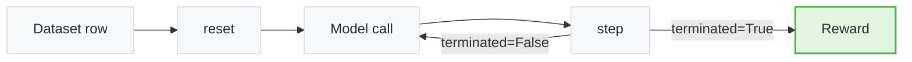

By the end of this tutorial, you will have written a tiny **"Guess the Number"** environment in ~25 lines of Python, wired it through a YAML config and a JSONL dataset, and scored an LLM agent against it. The shape is identical to [`blackjack`](https://github.com/NVIDIA-NeMo/Gym/tree/main/resources_servers/blackjack), the showcase Gymnasium-style environment.

<Card>

**Goal**: Build and run a minimal `GymnasiumServer` environment end-to-end.

**In this tutorial, you will**:

1. Subclass `GymnasiumServer` and implement `reset()` / `step()`.
2. Wire the environment to a `gymnasium_agent` via YAML.
3. Author the JSONL dataset that drives rollouts.
4. Run the env and read the agent's reward from `ng_reward_profile`.

</Card>

## Prerequisites

1. Completed the [Quickstart](/latest/get-started/quickstart) (you've run Blackjack end-to-end).
2. NeMo Gym virtual environment activated.
3. `env.yaml` configured (see [Configuration](/latest/get-started/configuration)).

<Tip>
**Time estimate**: ~15 minutes including the rollout run.
</Tip>

## Concepts Overview

Every Gymnasium-style environment in NeMo Gym is a class with two methods. The agent server calls them in a loop:



- **`reset(metadata, session_id)`** — set up per-rollout state, return the first message to the model.
- **`step(action, metadata, session_id)`** — score the model's response and return `(observation, reward, terminated, truncated, info)`. Return a non-`None` `observation` to continue the episode; return `None` and `terminated=True` to end it.
- **`session_state`** — a per-rollout dict on `GymnasiumServer` for storing game state across steps.

<Note title="See Also">
For multi-step, tool-calling, and LLM-as-judge patterns, refer to the [Gymnasium API reference](https://github.com/NVIDIA-NeMo/Gym/tree/main/resources_servers/gymnasium).
</Note>

## Tutorial Steps

### Scaffold the Files

1. **Create the directory tree**:

   ```bash
   mkdir -p resources_servers/guess_number/{configs,data}
   ```

   Final layout:

   ```text
   resources_servers/guess_number/
   ├── app.py
   ├── configs/guess_number.yaml
   ├── data/example.jsonl
   └── requirements.txt
   ```

2. **Add `requirements.txt`**:

   ```text
   -e nemo-gym[dev] @ ../../
   ```

**✅ Success Check**: `ls resources_servers/guess_number/` shows the expected directories.

### Implement the Environment

Write `resources_servers/guess_number/app.py`:

```python
import random
import re
from typing import Optional

from nemo_gym.openai_utils import NeMoGymResponse
from resources_servers.gymnasium import GymnasiumServer, extract_text


class GuessNumberEnv(GymnasiumServer):
    async def reset(self, metadata: dict, session_id: Optional[str] = None) -> tuple[Optional[str], dict]:
        secret = random.randint(1, 5)
        self.session_state[session_id] = {"secret": secret}
        return "Guess a number between 1 and 5. Respond with <answer>N</answer>.", {}

    async def step(
        self, action: NeMoGymResponse, metadata: dict, session_id: Optional[str] = None
    ) -> tuple[Optional[str], float, bool, bool, dict]:
        secret = self.session_state[session_id]["secret"]
        text = extract_text(action)
        m = re.search(r"<answer>\s*(\d+)\s*</answer>", text)
        guess = int(m.group(1)) if m else -1
        reward = 1.0 if guess == secret else 0.0
        return None, reward, True, False, {"secret": secret, "guess": guess}


if __name__ == "__main__":
    GuessNumberEnv.run_webserver()
```

**✅ Success Check**: `reset()` picks a secret and primes the model. `step()` parses the model's `<answer>` tag, scores it, and terminates.

### Wire the Configuration and Dataset

1. **Add the config** at `resources_servers/guess_number/configs/guess_number.yaml`:

   ```yaml
   guess_number:
     resources_servers:
       guess_number:
         entrypoint: app.py
         domain: games
         verified: false

   guess_number_gymnasium_agent:
     responses_api_agents:
       gymnasium_agent:
         entrypoint: app.py
         resources_server:
           type: resources_servers
           name: guess_number
         model_server:
           type: responses_api_models
           name: policy_model
         max_steps: 1
         datasets:
         - name: example
           type: example
           jsonl_fpath: resources_servers/guess_number/data/example.jsonl
   ```

2. **Add the example dataset** at `resources_servers/guess_number/data/example.jsonl`. One line per task — duplicate this row 5 times so the agent gets 5 chances:

   ```json
   {"responses_create_params": {"input": [{"role": "system", "content": "You are playing a guessing game. Reply with <answer>N</answer>."}, {"role": "user", "content": "Begin."}]}, "agent_ref": {"type": "responses_api_agents", "name": "guess_number_gymnasium_agent"}}
   ```

**✅ Success Check**: `wc -l resources_servers/guess_number/data/example.jsonl` returns 5.

### Run and Verify

1. **Start the servers** (Terminal 1):

   ```bash
   ng_run "+config_paths=[\
   resources_servers/guess_number/configs/guess_number.yaml,\
   responses_api_models/openai_model/configs/openai_model.yaml]"
   ```

2. **Collect rollouts** (Terminal 2):

   ```bash
   mkdir -p results
   ng_collect_rollouts \
       +agent_name=guess_number_gymnasium_agent \
       +input_jsonl_fpath=resources_servers/guess_number/data/example.jsonl \
       +output_jsonl_fpath=results/guess_rollouts.jsonl \
       +num_repeats=4
   ```

3. **Read the win rate**:

   ```bash
   ng_reward_profile \
       +materialized_inputs_jsonl_fpath=results/guess_rollouts_materialized_inputs.jsonl \
       +rollouts_jsonl_fpath=results/guess_rollouts.jsonl
   ```

   Example output:

   ```text
   key_metrics:
     mean/reward: 0.20
     max/reward:  1.00
     min/reward:  0.00
   ```

**✅ Success Check**: `mean/reward` lands near `0.2` for random guessing on 1-5. A model that anchors on a single number will hit higher or lower depending on the secret distribution.

## Summary

Here is what you built.

**You completed:**

- ✅ Subclassed `GymnasiumServer` and implemented `reset()` / `step()`.
- ✅ Wired the environment to `gymnasium_agent` via a single YAML config.
- ✅ Authored a JSONL dataset that drives the rollouts.
- ✅ Ran the env end-to-end and read the agent's reward.

**Learn more about the concepts:**

- **Resources Server** — [/latest/resources-server](/latest/resources-server)
- **Agent Server** — [/latest/agent-server](/latest/agent-server)
- **Task Verification** — [/latest/about/concepts/task-verification](/latest/about/concepts/task-verification)

## Next Steps

<Cards>

<Card title="Read blackjack/app.py" href="https://github.com/NVIDIA-NeMo/Gym/tree/main/resources_servers/blackjack">
Same shape, multi-step. The reference implementation.

<Badge minimal outlined>example</Badge>
</Card>

<Card title="Environment Tutorials" href="/latest/environment-tutorials">
Tool calling, multi-turn, LLM-as-judge, real-world environments.

<Badge minimal outlined>tutorials</Badge>
</Card>

<Card title="Contribute Environments" href="/latest/contribute/environments">
Submit your environment to the NeMo Gym hub.

<Badge minimal outlined>contribute</Badge>
</Card>

<Card title="Training Tutorials" href="/latest/training-tutorials">
Train a model on your custom environment.

<Badge minimal outlined>training</Badge>
</Card>

</Cards>

## Troubleshooting

If you hit issues, see the patterns documented in the [Quickstart](/latest/get-started/quickstart#troubleshooting) — most failures are credential or activation problems, not code. For Gymnasium-API-specific issues, refer to the [Gymnasium README](https://github.com/NVIDIA-NeMo/Gym/tree/main/resources_servers/gymnasium).
