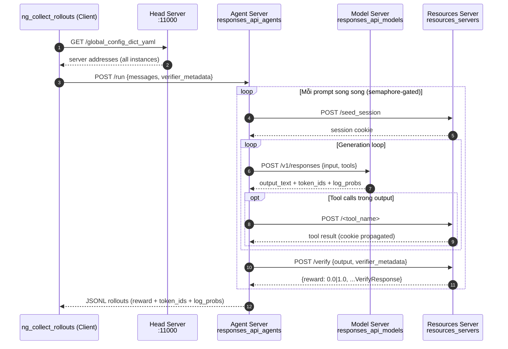
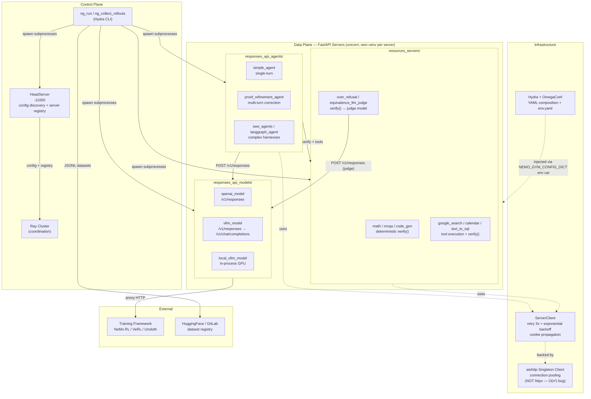

# Design Principles: nemo-gym

> Tổng hợp từ 9 upstream worklogs T1–T5. Mọi code reference đều clickable. Đây là tài liệu kiến trúc sống — cập nhật khi có deep-research mới.

---

## 1. Architecture Overview

*Nguồn: [[../tasks/nemo-gym-5py-nemo-gym-contextual-awareness.md]] (T1)*

### 1.1 Sequence Diagram — Main RL Rollout Flow



**Ghi chú quan trọng:**
- `token_ids` và `log_probs` propagate từ Model → Agent → output JSONL để RL framework tính policy gradient (GRPO/PPO).
- Session cookies carry toàn bộ stateful env context qua call stack — không có shared memory.
- Training framework integration (NeMo RL): KHÔNG có semaphore tại đây — framework quản lý concurrency ngoài.

### 1.2 Component Diagram — NeMo Gym Architecture



### 1.3 Flow Summary

| Flow name | Actors | Trigger | Output | Critical files |
|---|---|---|---|---|
| Server startup (control plane) | DevOps / RL Trainer | `ng_run +config_paths=[...]` | 3+ FastAPI servers healthy, Ray init | [`../../docs/about/concepts/architecture.md`](../../docs/about/concepts/architecture.md), [`../../nemo_gym/cli.py`](../../nemo_gym/cli.py) |
| Single rollout collection | RL Trainer / Evaluator | `ng_collect_rollouts` hoặc training framework HTTP | JSONL rollouts với reward + token_ids + log_probs | [`../../nemo_gym/rollout_collection.py`](../../nemo_gym/rollout_collection.py), [`../../docs/about/concepts/architecture.md`](../../docs/about/concepts/architecture.md) |
| Tool-call loop (multi-step) | Agent server (internal) | Model returns `function_call` in output | Tool result appended to conversation, loop tiếp | [`../../responses_api_agents/proof_refinement_agent/`](../../responses_api_agents/proof_refinement_agent/), [`../../nemo_gym/base_responses_api_agent.py`](../../nemo_gym/base_responses_api_agent.py) |
| Verify + reward | Resources server (internal) | `POST /verify` từ agent | `{reward: 0.0\|1.0, ...}` VerifyResponse | [`../../nemo_gym/base_resources_server.py`](../../nemo_gym/base_resources_server.py) |
| LLM-as-judge verification | Resources server (internal) | `verify()` cần semantic scoring | reward 0.0/0.5/1.0 từ judge verdict | [`../../docs/environment-tutorials/llm-as-judge-verification.md`](../../docs/environment-tutorials/llm-as-judge-verification.md) |
| Dataset upload (GitLab/HF) | DataOps / Benchmark Author | `ng_upload_dataset_to_gitlab` / `ng_upload_dataset_to_hf` | Dataset registered, `gitlab_identifier` trong YAML | [`../../nemo_gym/gitlab_utils.py`](../../nemo_gym/gitlab_utils.py) |
| Training framework integration | RL Trainer (NeMo RL / VeRL) | Training loop gọi NeMo Gym actor | Rollouts không semaphore → GRPO/PPO gradient update | [`../../docs/infrastructure/deployment-topology.md`](../../docs/infrastructure/deployment-topology.md) |

---

## 2. Core Components (Không thể thay thế)

*Nguồn: [[../tasks/nemo-gym-ir8-nemo-gym-strategic-evaluation.md]] (T2 — Axis 1)*

### Core 1: HeadServer — Service Registry & Config Distributor

- File: [`../../nemo_gym/server_utils.py#L694`](../../nemo_gym/server_utils.py#L694)
- Tại sao không thể thay thế: HeadServer là điểm duy nhất expose `/global_config_dict_yaml`. Mọi child server khởi động bằng cách đọc env var `NEMO_GYM_CONFIG_DICT` được inject từ đây. Nếu xóa HeadServer, không có cơ chế nào để child servers biết địa chỉ IP:port của nhau — toàn bộ inter-server routing sụp đổ. `RunHelper.start()` hardcode `HeadServer.run_webserver()` trước khi spawn bất kỳ subprocess nào ([`../../nemo_gym/cli.py#L135`](../../nemo_gym/cli.py#L135)).

```python
class HeadServer(BaseServer):
    def setup_webserver(self) -> FastAPI:
        app = FastAPI()
        app.get("/global_config_dict_yaml")(self.global_config_dict_yaml)
        app.get("/server_instances")(self.get_server_instances)
        return app
```

### Core 2: GlobalConfigDictParser — Single Source of Truth cho Config

- File: [`../../nemo_gym/global_config.py#L596`](../../nemo_gym/global_config.py#L596)
- Tại sao không thể thay thế: Cơ chế duy nhất giải quyết vòng đời config: (1) main proc parse từ CLI + YAML + env.yaml, (2) child proc deserialize từ `NEMO_GYM_CONFIG_DICT` env var. Tự động assign host/port cho từng server (`validate_and_populate_defaults`), detect misconfig, inject `ray_head_node_address`, và constrain package versions. Xóa thì mọi config validation và port allocation mất.

```python
def get_global_config_dict(...) -> DictConfig:
    global _GLOBAL_CONFIG_DICT
    if _GLOBAL_CONFIG_DICT is not None:
        return _GLOBAL_CONFIG_DICT
    nemo_gym_config_dict_str_from_env = getenv(NEMO_GYM_CONFIG_DICT_ENV_VAR_NAME)
    if nemo_gym_config_dict_str_from_env:
        global_config_dict = OmegaConf.create(nemo_gym_config_dict_str_from_env)
```

### Core 3: SimpleServer.run_webserver() — FastAPI Lifecycle Template

- File: [`../../nemo_gym/server_utils.py#L475`](../../nemo_gym/server_utils.py#L475)
- Tại sao không thể thay thế: `run_webserver()` là template method duy nhất orchestrate toàn bộ FastAPI startup: ulimit raise lên 65535 (critical cho 65k concurrent), middleware injection, uvicorn launch với multi-worker support. Ba base classes (`SimpleResourcesServer`, `SimpleResponsesAPIAgent`, model) đều inherit và chỉ override `setup_webserver()`. Xóa thì không có server nào khởi động được.

---

## 3. Leverage Points (Điểm tựa)

*Nguồn: [[../tasks/nemo-gym-ir8-nemo-gym-strategic-evaluation.md]] (T2 — Axis 2) + [[../tasks/nemo-gym-mpk-nemo-gym-code-mapping.md]] (T3 code tinh hoa)*

### Leverage 1: Global aiohttp ClientSession Singleton

- File: [`../../nemo_gym/server_utils.py#L74`](../../nemo_gym/server_utils.py#L74)
- LOC impact: ~70 dòng chi phối 100% inter-server HTTP transport
- Nguyên lý: Singleton (GoF) + Bulkhead Pattern + Connection Pool + Worker-aware partitioning

```python
_GLOBAL_AIOHTTP_CLIENT: Union[None, ClientSession] = None

def set_global_aiohttp_client(cfg: GlobalAIOHTTPAsyncClientConfig) -> ClientSession:
    num_workers = get_nemo_gym_fastapi_num_workers()
    client_session = ClientSession(
        connector=TCPConnector(
            limit=cfg.global_aiohttp_connector_limit // num_workers,   # default 100*1024 total
            limit_per_host=cfg.global_aiohttp_connector_limit_per_host // num_workers,
        ),
        timeout=ClientTimeout(),
        cookie_jar=DummyCookieJar(),
    )
    global _GLOBAL_AIOHTTP_CLIENT
    _GLOBAL_AIOHTTP_CLIENT = client_session
    return _GLOBAL_AIOHTTP_CLIENT

atexit.register(global_aiohttp_client_exit)
```

- Thay 1 dòng → impact: Thay `TCPConnector(limit=..., limit_per_host=...)` bằng `TCPConnector()` (default limit=100) → **100% requests timeout** khi concurrency > 100. Thay `DummyCookieJar()` bằng `CookieJar()` → session state corrupt (cookies bị merge across requests).
- Tại sao tinh hoa: Đây là quyết định kiến trúc từ production incident thực tế — httpcore O(n²) `_assign_requests_to_connections` gây **40-phút hang** tại 16,000 concurrent requests (Sep 17, 2025). Chi tiết tại [`../../docs/infrastructure/engineering-notes/aiohttp-vs-httpx.md`](../../docs/infrastructure/engineering-notes/aiohttp-vs-httpx.md).

### Leverage 2: SimpleResourcesServer — Template Method + Abstract verify()

- File: [`../../nemo_gym/base_resources_server.py#L57`](../../nemo_gym/base_resources_server.py#L57)
- LOC: 89 dòng định nghĩa toàn bộ extensibility contract cho 80+ benchmarks
- Nguyên lý: Template Method (GoF) + Interface Segregation (SOLID ISP) + Open/Closed Principle

```python
class SimpleResourcesServer(BaseResourcesServer, AggregateMetricsMixin, SimpleServer):
    config: BaseResourcesServerConfig

    def setup_webserver(self) -> FastAPI:
        app = FastAPI()
        self.setup_session_middleware(app)
        app.post("/seed_session")(self.seed_session)
        app.post("/verify")(self.verify)
        app.post("/aggregate_metrics")(self.aggregate_metrics)
        return app

    @abstractmethod
    async def verify(self, body: BaseVerifyRequest) -> BaseVerifyResponse:
        pass
```

- Thay 1 dòng → impact: Xóa `self.setup_session_middleware(app)` → **100% stateful environments mất session tracking**, mọi multi-step benchmark broken.
- Tại sao tinh hoa: 89 LOC "frozen skeleton, hot spots" — developer chỉ implement `verify()`, mọi thứ khác (routing, middleware ordering, aggregate_metrics, error handling) có sẵn. Xóa pattern này = 2400 dòng boilerplate lặp lại qua 80+ servers.

### Leverage 3: GlobalConfigDictParser.parse() — Hydra Cascading Composition

- File: [`../../nemo_gym/global_config.py#L385`](../../nemo_gym/global_config.py#L385)
- LOC: Toàn file 797 dòng; hàm parse() ~90 dòng
- Nguyên lý: Configuration-as-Code + Chain of Responsibility (GoF) + Single Source of Truth

Priority cascade được encode trực tiếp: `yaml_files < env.yaml < CLI args`

```python
# CLI dict đứng cuối = highest priority
global_config_dict = OmegaConf.merge(*extra_configs, global_config_dict)
```

- Thay 1 dòng → impact: Đổi `OmegaConf.merge(*extra_configs, global_config_dict)` thành `OmegaConf.merge(global_config_dict, *extra_configs)` → **CLI overrides bị env.yaml override ngược**, mọi `+key=value` từ terminal bị ignore → 100% CLI-driven workflows broken.

### Leverage 4: Cookie Propagation Chain trong simple_agent

- File: [`../../responses_api_agents/simple_agent/app.py#L80`](../../responses_api_agents/simple_agent/app.py#L80)
- LOC: ~90 dòng `responses()` method
- Nguyên lý: Session affinity (Cookie-based) + RL gradient feed (token-level log_probs)

```python
model_server_cookies = None
resources_server_cookies = request.cookies  # carry incoming session
...
model_server_cookies = model_response.cookies
resources_server_cookies = api_response.cookies
# Propogate any extra cookies necessary for downstream verification
for k, v in (*resources_server_cookies.items(), *model_server_cookies.items()):
    response.set_cookie(k, v)
```

- Thay 1 dòng → impact: Xóa `cookies=resources_server_cookies` trong POST đến resources server → **100% stateful environments mất session context**, reward tính sai với mọi multi-turn benchmark.

---

## 4. Design Principles & Rationale (per layer)

## 4.1 Data / Storage

*Nguồn: [[../tasks/nemo-gym-0t4.1-nemo-gym-deep-research-data-storage.md]] (T4.1)*

#### Top Decision: `gitlab_identifier` + `jsonl_fpath` Coexistence — Strategy + Cache Pattern

**Nguyên lý:** Strategy Pattern (GoF) cho dataset source + Cache Pattern (POSA) cho local path.

Trong [`../../nemo_gym/config_types.py`](../../nemo_gym/config_types.py), `DatasetConfig` có đồng thời:
- `jsonl_fpath: str` — local filesystem path (luôn bắt buộc)
- `gitlab_identifier: Optional[...]` — remote registry pointer (source strategy)
- `huggingface_identifier: Optional[...]` — HF registry pointer

Hai field này **không thay thế nhau** — chúng thực hiện hai responsibility hoàn toàn khác:
- `*_identifier` = "tìm dataset ở đâu trên remote"
- `jsonl_fpath` = "đọc dataset từ đâu trên local"

**Tại sao không đơn giản hơn:** HPC cluster (Lustre filesystem) không có internet trong training job — download phải trước trên login node, sau đó dùng local path. `version="0.0.1"` pinned — rollback về dataset cũ chỉ cần đổi YAML, không sửa code.

**Quyết định bổ sung: Example dataset in-git, Train/Validation in registry**

`data/.gitignore` gitignore `*train.jsonl`, `*validation.jsonl` nhưng KHÔNG gitignore `example.jsonl`. Trong [`../../nemo_gym/cli.py`](../../nemo_gym/cli.py), CI validation enforce `count == 5` entries trong `example.jsonl` — fail ngay nếu thiếu. Logic: 5 entries là minimum viable CI fixture; train/val lớn (GB-TB) sẽ bloat git.

**Quyết định bổ sung: `verifier_metadata` Opaque Schema**

`BaseVerifyRequest.verifier_metadata: Dict[str, Any]` — framework pass-through, không validate nội dung. Math benchmark cần `{"expected_answer": "42"}`, code benchmark cần `{"test_cases": [...]}` — không thể unify mà không dùng 50+ discriminated Union types. Tradeoff: schema error chỉ phát hiện khi `verify()` chạy (runtime), nhưng `ng_prepare_data` + 5-entry validation catch sớm.

## 4.2 Business Logic

*Nguồn: [[../tasks/nemo-gym-0t4.2-nemo-gym-deep-research-business-logic.md]] (T4.2)*

#### Top Decision: Reward Binary 0.0/1.0 thay vì continuous float [0,1]

**File:** [`../../nemo_gym/base_resources_server.py`](../../nemo_gym/base_resources_server.py) (line 46: `reward: float` trong `BaseVerifyResponse`) + [`../../nemo_gym/reward_profile.py`](../../nemo_gym/reward_profile.py) (line 379-386: `is_binary` branch)

**Nguyên lý: RLVR (RL with Verifiable Rewards)**

RLVR là paradigm trong đó reward signal đến từ **deterministic verifier** (compiler, unit test, SQL executor, math checker). Khi verifier deterministic, kết quả chỉ có 2 trạng thái: pass (1.0) hoặc fail (0.0). Đây là property intrinsic của verifiable tasks.

Bằng chứng nhất quán qua 5 servers:
- `BigCodeBenchResourcesServer.verify()`: `reward=1.0 if status == "pass" else 0.0`
- `PythonExecutorResourcesServer.verify()` (math_with_code): `reward = 1.0 if accuracy else 0.0`
- `JailbreakDetectionResourcesServer`: `reward_if_safe: float = 1.0`, `reward_if_unsafe: float = 0.0`
- `example_single_tool_call`: `reward=1.0` hardcoded
- `reward_profile.py` line 379: `is_binary = all(v in (0, 1, 0.0, 1.0) for v in vals)` — framework biết binary là default

**4 vấn đề của continuous reward:**
1. **Reward hacking:** model học tối ưu proxy (code trông giống đúng nhưng không pass test).
2. **Aggregation complexity:** binary → `pass@k` có công thức combinatorial chính xác; continuous không có `pass@k` chuẩn.
3. **RL gradient stability:** GRPO/PPO với binary cho gradient rõ ràng.
4. **Benchmark comparability:** `pass@k` là metric cộng đồng chấp nhận rộng rãi (HumanEval, MBPP, MATH, AIME).

**Historical:** DeepSeek R1 paper (Jan 2025, arXiv 2501.12948) xác nhận binary RLVR scale tốt hơn continuous reward model ở quy mô lớn.

**Quyết định bổ sung: Template Method + Strategy trong base classes**

Ba base classes (`SimpleResourcesServer`, `SimpleResponsesAPIAgent`, `SimpleResponsesAPIModel`) định nghĩa skeleton bất biến trong `setup_webserver()`. Phần biến thiên duy nhất là `verify()` / `responses()` / `run()` — `@abstractmethod`. Nếu dùng plain FastAPI function: ~30 dòng boilerplate × 80+ servers = ~2400 dòng duplicate.

**Quyết định bổ sung: Agent là HTTP server độc lập**

Mỗi agent là process độc lập chạy FastAPI server riêng. Ranh giới là mạng HTTP, không phải Python import. Key tradeoff: deployment cost vs isolation + scaling + GIL avoidance. Với 16k concurrent rollouts, in-process sẽ đụng GIL và shared state.

## 4.3 Interface / API

*Nguồn: [[../tasks/nemo-gym-0t4.3-nemo-gym-deep-research-interface-api.md]] (T4.3)*

#### Top Decision: `openai<=2.7.2` Upper Bound Lock — Schema Stability vs Release Velocity

**File:** [`../../pyproject.toml`](../../pyproject.toml) lines 85–89

```toml
# OpenAI: We leverage OpenAI Responses, Chat Completions, and Completions schemas for Nemo Gym abstractions.
# We specifically upper bound this OpenAI dependency since the version bumps so frequently.
# Updated Wed Feb 17, 2026 with openai<=2.7.2
"openai<=2.7.2",
```

**Nguyên lý:** NeMo Gym dùng openai SDK **chỉ như type/schema library** — không dùng SDK client thực (thay vào đó là `NeMoGymAsyncOpenAI`, một aiohttp wrapper stub tại [`../../nemo_gym/openai_utils.py#L468`](../../nemo_gym/openai_utils.py#L468)). 50+ imports từ `openai.types.*` khiến weekly breaking changes của openai là critical risk.

**3 risk vectors từ weekly release:**
1. TypedDict → BaseModel migration: `openai_utils.py` line 172 đã phải workaround một case.
2. `Iterable` → `List` overrides: NeMo Gym override hàng chục fields để tránh lazy iterator trong Pydantic validation (comments lặp đi lặp lại trong code).
3. Schema rename trong `openai.types.responses.*` module còn mới.

**Extension mechanism:** [`../../nemo_gym/openai_utils.py#L100`](../../nemo_gym/openai_utils.py#L100)

```python
class TokenIDLogProbMixin(BaseModel):
    prompt_token_ids: List[int]
    generation_token_ids: List[int]
    generation_log_probs: List[float]
```

NeMo Gym subclass openai types, add RL fields, vẫn pass validation cho OpenAI-compatible clients (Adapter/Anti-Corruption Layer pattern).

**Quyết định bổ sung: FastAPI thay vì gRPC**

4 lý do: (1) Proto compilation barrier — ML researcher muốn add field phải edit `.proto`, regenerate stubs; (2) Debug opacity — binary protobuf không readable bằng `curl`; (3) OpenAI schema incompatibility — OpenAI REST là JSON/HTTP; (4) Python ecosystem — FastAPI/Pydantic là lingua franca của Python ML serving.

**Quyết định bổ sung: `/v1/responses` + `/v1/chat/completions` cùng server**

[`../../nemo_gym/base_responses_api_model.py`](../../nemo_gym/base_responses_api_model.py) expose cả hai. Đây là **Strangler Fig** migration pattern (Martin Fowler): Responses API mới được add bên cạnh Chat Completions cũ thay vì replace. `SimpleResponsesAPIAgent` chỉ expose `/v1/responses` — agent layer đã "lean Responses API" trong khi model layer giữ backward compat.

## 4.4 Infrastructure

*Nguồn: [[../tasks/nemo-gym-0t4.4-nemo-gym-deep-research-infrastructure.md]] (T4.4)*

#### Top Decision: aiohttp Singleton thay vì httpx — Production Incident Root Cause

**Files:**
- [`../../nemo_gym/server_utils.py#L74`](../../nemo_gym/server_utils.py#L74) — `_GLOBAL_AIOHTTP_CLIENT` singleton
- [`../../docs/infrastructure/engineering-notes/aiohttp-vs-httpx.md`](../../docs/infrastructure/engineering-notes/aiohttp-vs-httpx.md) — engineering note gốc (Sep 17, 2025 incident)
- [`../../resources_servers/tavily_search/app.py#L133`](../../resources_servers/tavily_search/app.py#L133) — `TavilySearchAIOHTTPClient` adapter pattern

**Root cause của quyết định:**

```
OpenAI client → httpx._client:1014 → httpx._transports.default:250
→ httpcore._async.connection_pool:228 _assign_requests_to_connections()
  → loop connections (L284)
    → loop queued_requests (L303)  ← O(n²) total
```

Khi NeMo Gym nhận 16,000 concurrent requests (Sep 17, 2025, triggered bởi DeepSeek R1 Nature paper, 16 off-policy steps × 1,000 rollouts), **system treo 40 phút** không xử lý được request nào. O(n²) = 256,000,000 iterations trong event loop.

**3 tầng giải pháp:**
1. **Singleton** — toàn bộ app chỉ có 1 `ClientSession`, share 1 DNS cache + 1 TCP pool.
2. **Bulkhead** — `limit // num_workers` phân phối tài nguyên đều giữa các uvicorn worker.
3. **atexit cleanup** — graceful shutdown ngay cả khi process bị kill.

**Adapter pattern** khi dùng 3rd-party libs có httpx: [`../../resources_servers/tavily_search/app.py`](../../resources_servers/tavily_search/app.py) implement `TavilySearchAIOHTTPClient` wrap httpx interface bằng aiohttp transport — giữ nguyên API surface, thay HTTP transport.

**Quyết định bổ sung: Ray Cluster Init + RAY_TMPDIR=/tmp Gotcha**

File: [`../../nemo_gym/server_utils.py#L395`](../../nemo_gym/server_utils.py#L395) — `initialize_ray()`

Root cause: Linux AF_UNIX socket pathname limit = **107 bytes** (108 bytes - null terminator, hardcode trong `sys/un.h`). Trên HPC clusters với Lustre filesystem, CWD dài `/lustre/fsw/portfolios/llmservice/...` khiến Ray socket path vượt limit → silent failure. Fix: `RAY_TMPDIR=/tmp` trước khi chạy.

**Lưu ý:** `os.environ` changes trong Python không propagate sang subprocess — phải set externally: `RAY_TMPDIR=/tmp ng_test +entrypoint=...`

**Quyết định bổ sung: Per-Server venv Isolation**

File: [`../../nemo_gym/cli.py#L605`](../../nemo_gym/cli.py#L605) — `test_all()` tạo `.venv` per server.

Lý do không dùng tox/nox: (1) Dependency conflict hell ở scale 20+ servers mỗi server có dep riêng; (2) External tool install side effects (`apt-get libreoffice`, Docker images) không thể wrap trong tox; (3) `skip_venv_if_present` optimization pattern. Comment trong code: *"parallel installation can produce a cache 10-20GB larger than serial installation"*.

## 4.5 Cross-layer

*Nguồn: [[../tasks/nemo-gym-0t4-nemo-gym-deep-research-parent.md]] (T4 parent synthesis)*

#### 5 Cross-layer Patterns

| Pattern | Layers | Evidence |
|---|---|---|
| **Async-First, Semaphore-Bounded** | 4/4 layers | aiohttp singleton (Infra) + `asyncio.Semaphore` trong verify() (Business) + ASGI/uvicorn stack (API) + async dataset download (Data) |
| **Config-as-Code via Hydra Injection** | 4/4 layers | Hydra merge pipeline (Data) + policy flag routing (Business) + `openai` version pin audit trail (API) + `limit=cfg.global_aiohttp_connector_limit // num_workers` config-driven (Infra) |
| **Pydantic Schema Everywhere** | 4/4 layers | `DatasetConfig` validator (Data) + `BaseVerifyResponse` (Business) + `TokenIDLogProbMixin` (API) + `GlobalConfig` Pydantic (Infra) |
| **Service-Oriented HTTP Boundary** | 3/4 layers | Agent←→Model←→Resources via HTTP (Business) + endpoints `/v1/responses`, `/v1/chat/completions` (API) + `ServerClient` retry + cookie propagation (Infra) |
| **Explicit Error Handling + Retry** | 3/4 layers | `None` verdict → `reward=0.0` fail-safe (Business) + exception_handling_middleware stack (API) + `MAX_NUM_TRIES=3` + `atexit` cleanup (Infra) |

#### 2 Inconsistencies phát hiện

**Inconsistency 1: Reward không hoàn toàn binary ở mọi server**

`jailbreak_detection` với `use_combined_reward=True` tạo `reward=0.5` — continuous reward ngoại lệ trong ecosystem mostly-binary. `text_to_sql` có `config.reward_if_swap_fails` — không hardcode về 0.0. Không có enforcement mechanism — Pydantic chỉ validate `float`, không validate `∈ {0.0, 1.0}`.

**Inconsistency 2: openai SDK như type library nhưng vẫn là runtime dependency**

NeMo Gym dùng openai SDK chỉ như schema library nhưng `pyproject.toml` pin `openai<=2.7.2` như runtime dep — kéo theo toàn bộ HTTP client code của openai vào production image dù không dùng. Pragmatic choice (extract sang `openai-stubs` tốn maintenance), nhưng là tradeoff chưa được document đầy đủ.

#### Top 3 Design Principles xuyên suốt NeMo Gym

**Principle 1: Async-First, Semaphore-Bounded Concurrency**

Mọi I/O operation là coroutine; mọi resource-bounded operation có `asyncio.Semaphore`; không có blocking call trong event loop. Rationale: NeMo Gym phải handle 16,000 concurrent rollouts. Synchronous code ở bất kỳ điểm nào = bottleneck toàn bộ pipeline.

Evidence: [aiohttp O(n²) incident](../tasks/nemo-gym-0t4.4-nemo-gym-deep-research-infrastructure.md) — *"system treo 40 phút trước khi xử lý request đầu tiên"* + [bigcodebench verify()](../tasks/nemo-gym-0t4.2-nemo-gym-deep-research-business-logic.md): `async with self._semaphore: result = await self._run_in_venv(...)`

**Principle 2: Pydantic-Enforced Contract at Every Boundary**

Không có untyped dict ở wire boundary. Mọi request, response, config, và cross-server message đều là Pydantic model với validator. Rationale: Với 20+ benchmark servers và N contributors, thiếu type contract = runtime surprise ở production RL training khi debugging 16k rollouts.

Evidence: [DatasetConfig validator](../tasks/nemo-gym-0t4.1-nemo-gym-deep-research-data-storage.md) + [TokenIDLogProbMixin](../tasks/nemo-gym-0t4.3-nemo-gym-deep-research-interface-api.md) + [BaseVerifyResponse](../tasks/nemo-gym-0t4.2-nemo-gym-deep-research-business-logic.md)

**Principle 3: Convention over Configuration, Template Method for Extension**

Framework cung cấp skeleton cố định (lifecycle, routing, middleware); developer chỉ override hook method (`verify()`, `run()`, `responses()`). Rationale: 80+ benchmark servers không thể maintain nếu mỗi server phải setup FastAPI app, middleware, error handling riêng.

Evidence: [Template Method + Strategy](../tasks/nemo-gym-0t4.2-nemo-gym-deep-research-business-logic.md) — *"skeleton bất biến... Phần biến thiên duy nhất là `verify()` — @abstractmethod"* + [example dataset convention](../tasks/nemo-gym-0t4.1-nemo-gym-deep-research-data-storage.md): `init_resources_server()` hardcode pattern vào CLI + [per-server venv convention](../tasks/nemo-gym-0t4.4-nemo-gym-deep-research-infrastructure.md)

---

## 5. Mental Shortcuts & Exercises

*Nguồn: [[../tasks/nemo-gym-a37-nemo-gym-skill-transfer.md]] (T5 skill transfer)*

### 5.1 Mental Shortcuts (4 góc nhìn khác nhau)

#### Shortcut 1 — Config Perspective: "YAML top-level key = 1 process"

**Phát biểu:** Mỗi top-level key trong merged YAML config là 1 server instance độc lập. Muốn hiểu hệ thống đang chạy gì, đọc config — không cần đọc code.

**Cơ chế:** [`../../nemo_gym/global_config.py#L385`](../../nemo_gym/global_config.py#L385) — `filter_for_server_instance_configs()` tách riêng các key là server instance, `validate_and_populate_defaults()` auto-assign host/port. Developer không bao giờ hardcode port.

**Lối tắt thực hành:**
- Gặp config mới → đọc top-level keys trước → biết ngay có bao nhiêu process.
- Muốn thêm 1 server → thêm 1 top-level key, không sửa code.
- Debug port conflict → kiểm tra `disallowed_ports` trong merged config (`ng_dump_config`).

**Liên kết:** [T4.1 — Hydra Composition](../tasks/nemo-gym-0t4.1-nemo-gym-deep-research-data-storage.md)

---

#### Shortcut 2 — Function Perspective: "verify() là duy nhất bạn cần implement"

**Phát biểu:** Khi thêm benchmark mới, chỉ 1 method bắt buộc: `async def verify(self, body) -> BaseVerifyResponse`. Mọi thứ khác đã có trong skeleton.

**Cơ chế:** [`../../nemo_gym/base_resources_server.py#L57`](../../nemo_gym/base_resources_server.py#L57) — 89 LOC định nghĩa toàn bộ extensibility contract.

**Lối tắt thực hành:**
- Đọc codebase server mới → `grep -n "def verify"` → tìm được business logic ngay.
- Khi review PR benchmark mới → chỉ cần xem `verify()` body + `VerifyResponse` fields.
- Nếu `verify()` gọi external process → tìm `asyncio.Semaphore` ngay bên trên.

**Liên kết:** [T4.2 — Template Method + Strategy](../tasks/nemo-gym-0t4.2-nemo-gym-deep-research-business-logic.md) + [T3 — Code tinh hoa](../tasks/nemo-gym-mpk-nemo-gym-code-mapping.md)

---

#### Shortcut 3 — Async/Failure Perspective: "Tìm sync I/O = tìm time bomb"

**Phát biểu:** NeMo Gym xử lý 16,000+ concurrent rollouts. Bất kỳ blocking call nào trong event loop = toàn bộ rollout collection đóng băng.

**3 tầng phòng thủ:**
1. **Transport:** [`../../nemo_gym/server_utils.py#L74`](../../nemo_gym/server_utils.py#L74) — `_GLOBAL_AIOHTTP_CLIENT` singleton, 1 `TCPConnector(limit=N//num_workers)`.
2. **Subprocess:** `async with self._semaphore:` bao quanh external call trong `bigcodebench/app.py`.
3. **Adapter:** Nếu thư viện ngoài dùng httpx → wrap bằng `TavilySearchAIOHTTPClient` pattern tại [`../../resources_servers/tavily_search/app.py`](../../resources_servers/tavily_search/app.py).

**Lối tắt thực hành:**
- Audit server mới: `grep -rn "requests\.\|httpx\.\|\.get(\|\.post(" app.py` → phải ra 0 hit ngoài test file.
- `RAY_TMPDIR=/tmp` luôn set trước khi chạy tests có Ray (socket path > 107 bytes = silent hang).

**Liên kết:** [T4.4 — aiohttp O(n²) incident](../tasks/nemo-gym-0t4.4-nemo-gym-deep-research-infrastructure.md) + [Engineering note](../../docs/infrastructure/engineering-notes/aiohttp-vs-httpx.md)

---

#### Shortcut 4 — Data Perspective: "verifier_metadata là Hydra escape hatch — opaque by design"

**Phát biểu:** `verifier_metadata` là dict không có schema cố định — framework pass-through từ JSONL input vào `verify()`. Intentional: mỗi benchmark tự define schema bên trong.

**Cơ chế:** `BaseVerifyRequest.verifier_metadata: Dict[str, Any]` tại [`../../nemo_gym/base_resources_server.py`](../../nemo_gym/base_resources_server.py) — `Any` type. Tương tự, `gitlab_identifier` + `jsonl_fpath` coexist vì hai responsibility khác nhau hoàn toàn.

**Lối tắt thực hành:**
- Thiết kế data mới → bỏ task-specific fields vào `verifier_metadata`, không sửa framework schema.
- Debug "verify() nhận sai data" → kiểm tra `verifier_metadata` trong JSONL input trước.
- `jsonl_fpath` luôn bắt buộc kể cả khi có `gitlab_identifier` (local download target, không xóa được).

**Liên kết:** [T4.1 — gitlab_identifier + jsonl_fpath coexistence](../tasks/nemo-gym-0t4.1-nemo-gym-deep-research-data-storage.md) + [T4 Parent — Pattern 3: Pydantic Schema](../tasks/nemo-gym-0t4-nemo-gym-deep-research-parent.md)

---

### 5.2 Exercises

#### Exercise 1: Build `length_check` Resources Server từ Template

**Goal:** Tạo resources server `length_check` với `verify()` trả `reward=1.0` khi `len(output_text) >= min_length`, verify bằng `ng_test` exit 0 và coverage >= 95%.

**Setup:**
```bash
git checkout -b practice-length-check
uv venv && uv sync --extra dev
ls resources_servers/example_single_tool_call/app.py  # confirm template tồn tại
ng_test --help 2>&1 | head -5
```

**Steps (tóm tắt):**
1. `cp -r resources_servers/example_single_tool_call resources_servers/length_check`
2. Sửa `app.py` — override `verify()`: `reward = 1.0 if len(output_text) >= self.config.min_length else 0.0`
3. Tạo `configs/length_check.yaml` với `min_length: 10`
4. Tạo `data/example.jsonl` (5 entries — 3 dài ≥10 chars, 2 ngắn)
5. Sửa `tests/test_app.py` test cả 2 cases

**Verify:**
```bash
RAY_TMPDIR=/tmp ng_test +entrypoint=resources_servers/length_check
```

**Estimated:** 60–90 phút. **Nguyên lý applied:** [T4.2 — Template Method](../tasks/nemo-gym-0t4.2-nemo-gym-deep-research-business-logic.md) + [T4.1 — YAML Composition](../tasks/nemo-gym-0t4.1-nemo-gym-deep-research-data-storage.md) + [T4 Parent — Convention over Configuration](../tasks/nemo-gym-0t4-nemo-gym-deep-research-parent.md)

---

#### Exercise 2: aiohttp Adapter cho Mock HTTP Library

**Goal:** Implement `MockAIOHTTPClient` wrap mock HTTP library theo pattern `TavilySearchAIOHTTPClient`, verify bằng stress test 100 concurrent requests pass và không leak file descriptors.

**Setup:**
```bash
git checkout -b practice-aiohttp-adapter
uv venv && uv sync --extra dev
grep -n "class TavilySearchAIOHTTPClient" resources_servers/tavily_search/app.py
python -c "import pytest_asyncio; print('pytest-asyncio OK')"
```

**Steps (tóm tắt):**
1. Implement `MockAIOHTTPClient` dùng `get_global_aiohttp_client()` — không tạo `ClientSession` mới
2. Write stress test với `asyncio.gather(*[mock_client.post(...) for _ in range(100)])`
3. Verify fd count: `fd_after - fd_before < 10`
4. Audit: `grep -rn "import httpx\|import requests" mock_client.py || echo "AUDIT_PASS"`

**Verify:**
```bash
RAY_TMPDIR=/tmp pytest -k "stress" resources_servers/length_check/tests/ -v
grep -rn "import httpx\|import requests" resources_servers/length_check/mock_client.py \
  && echo "AUDIT_FAIL" || echo "AUDIT_PASS"
```

**Estimated:** 60 phút. **Nguyên lý applied:** [T4.4 — aiohttp O(n²) incident](../tasks/nemo-gym-0t4.4-nemo-gym-deep-research-infrastructure.md) + [T4 Parent — Principle 1: Async-First](../tasks/nemo-gym-0t4-nemo-gym-deep-research-parent.md) + [T3 — aiohttp Singleton](../tasks/nemo-gym-mpk-nemo-gym-code-mapping.md)

---

#### Exercise 3 (optional): Mock ResponsesAPIModel trả output cố định

**Goal:** Tạo `responses_api_models/mock_model` trả output cố định `"42"` cho mọi request, dùng cho dev/testing không cần GPU.

**Steps (tóm tắt):**
1. `cp -r responses_api_models/openai_model responses_api_models/mock_model`
2. Override `chat_completions()` + `responses()` trả constant `"42"`
3. Tạo `configs/mock_model.yaml`
4. Pair với `length_check` (Exercise 1): output `"42"` len=2 < min_length=10 → reward=0.0 consistent qua 5 lần gọi

**Verify:**
```bash
RAY_TMPDIR=/tmp ng_test +entrypoint=responses_api_models/mock_model
RAY_TMPDIR=/tmp pytest responses_api_models/mock_model/tests/ -k "consistent" -v
```

**Estimated:** 30–45 phút. **Nguyên lý applied:** [T4.3 — Mimic OpenAI Responses API + dual endpoints](../tasks/nemo-gym-0t4.3-nemo-gym-deep-research-interface-api.md) + [T4.2 — Agent as HTTP server (SOA)](../tasks/nemo-gym-0t4.2-nemo-gym-deep-research-business-logic.md)

---

## Notion Sync Status

- **Status:** Skipped
- **Reason:** Notion MCP not authenticated in this session (mcp__notion__authenticate available but not connected; no mcp__notion__notion-create-pages tool found in available tools)
- **Manual sync command:** Run `/viec ghi` or use Notion web UI to paste content from `self-explores/context/nemo-gym-design-principles.md`
