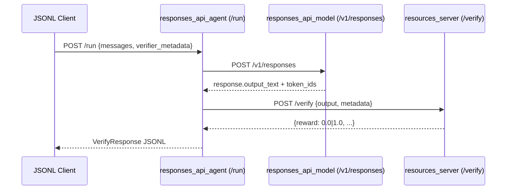
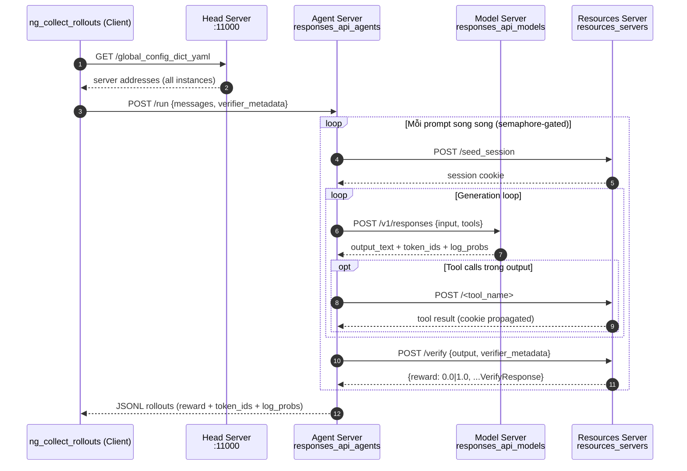
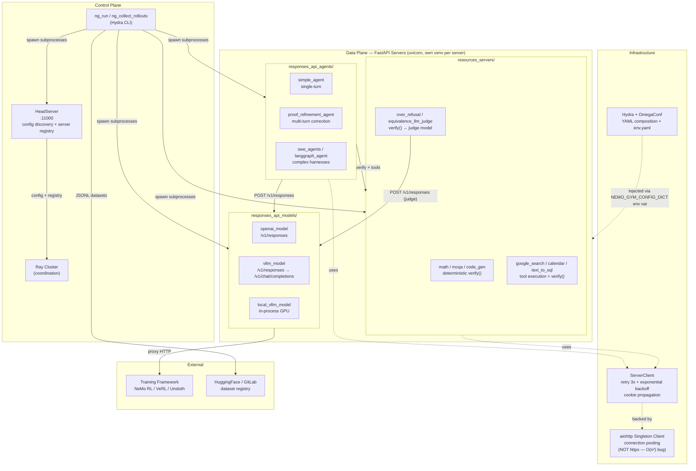
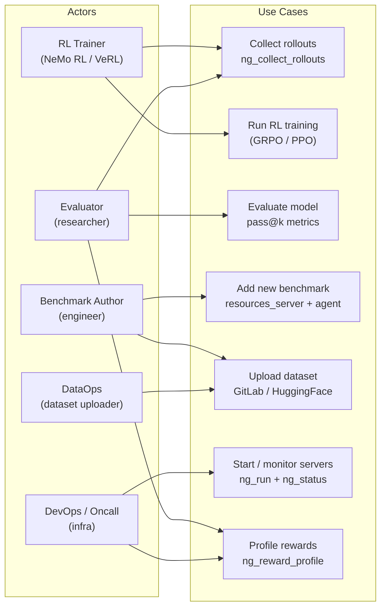

# nemo-gym — Contextual Awareness (SAD / Diagrams) — Detailed Design

## 1. Objective
Tạo Architecture Overview cho nemo-gym bằng cách: (1) ưu tiên tìm SAD/diagrams sẵn có trong `self-explores/`, (2) sau đó là `docs/`, `fern/`, `README.md`, (3) nếu thiếu thì generate Mermaid diagrams từ code. Output gồm ≥2 diagrams + bảng Flow Summary clickable.

## 2. Scope

**In-scope:**
- Quét `self-explores/{tasks,context,learnings,decisions}/*.md` tìm diagrams/SAD đã có.
- Quét `docs/`, `fern/`, README root + README mỗi `resources_servers/*`, `responses_api_*/*`.
- Generate Mermaid: sequence diagram (main flow), component diagram (3 server types + HeadServer + Ray), use-case diagram (actors).
- Bảng Flow Summary 4 cột (Flow name, Actors, Trigger, Output, Critical files).

**Out-of-scope:**
- KHÔNG sửa code production.
- KHÔNG vẽ database schema (nemo-gym là stateless services).
- KHÔNG generate Notion page (việc T6 `nemo-gym-86t`).
- KHÔNG phân tích leverage points (việc T2/T3).

## 3. Input / Output

**Input:**
- `self-explores/` (mới setup, có khả năng trống).
- `docs/` (đặc biệt [`docs/infrastructure/engineering-notes/aiohttp-vs-httpx.md`](../../docs/infrastructure/engineering-notes/aiohttp-vs-httpx.md) — context infra quan trọng).
- `fern/` (public docs).
- [`README.md`](../../README.md) root (đã có Architecture section ngắn).
- [`CLAUDE.md`](../../CLAUDE.md) (có 3 server types + base hierarchy diagram text).

**Output:**
- File worklog: `self-explores/tasks/nemo-gym-5py-nemo-gym-contextual-awareness.md` (file này, sẽ được append worklog khi `in_progress`).
- ≥2 Mermaid diagrams embedded (sequence + component).
- Bảng Flow Summary có ≥3 dòng.
- Section "Sources" liệt kê nguồn đã đọc.

## 4. Dependencies
- Beads: none (root task).
- Tools: ripgrep / `find` / `grep` để scan.
- Không cần GPU / Ray / network — task chỉ đọc + viết markdown.

## 5. Flow xử lý

### Step 1: Quét `self-explores/` (~5 phút)
```bash
find self-explores -name "*.md" -not -name "_index.md" -not -path "*/samples/*" 2>/dev/null | head -20
grep -l "mermaid\|sequenceDiagram\|graph TD\|graph LR" self-explores/**/*.md 2>/dev/null
```
**Verify:** Liệt kê được set file (có thể rỗng → ghi "self-explores trống").

### Step 2: Quét repo docs (~10 phút)
```bash
ls docs/ fern/ 2>&1
find docs fern -name "*.md" 2>/dev/null | head -30
grep -l "mermaid\|sequenceDiagram" docs/**/*.md fern/**/*.md 2>/dev/null
cat README.md | head -100   # extract Architecture section
```
**Verify:** Có liệt kê file + content snippet relevant.

### Step 3: Sinh Mermaid diagrams (nếu thiếu) (~10-15 phút)
**Sequence diagram (main flow):**

**Component diagram:** 3 server types + HeadServer + Ray + aiohttp singleton + ServerClient retry.
**Use-case diagram:** actors = RL trainer, dataset uploader (gitlab), benchmark author, devops/oncall.

**Verify:** Mermaid blocks render OK trong VSCode preview / Obsidian.

### Step 4: Bảng Flow Summary (~5 phút)
| Flow name | Actors | Trigger | Output | Critical files |
|---|---|---|---|---|
| Single rollout | RL Trainer | `ng_collect_rollouts` CLI | JSONL rollouts | [`nemo_gym/rollout_collection.py`](../../nemo_gym/rollout_collection.py) |
| Verify | Agent server | POST /verify | reward 0/1 + metadata | [`nemo_gym/base_resources_server.py`](../../nemo_gym/base_resources_server.py) |
| Multi-turn agent | proof_refinement_agent | POST /run | iterative correction | [`responses_api_agents/proof_refinement_agent/app.py`](../../responses_api_agents/proof_refinement_agent/app.py) |

### Step 5: Section Sources (~3 phút)
Liệt kê rõ ràng nguồn cho mỗi finding (self-explores vs repo).

## 6. Edge Cases & Error Handling
| Case | Trigger | Expected | Recovery |
|---|---|---|---|
| `self-explores/` trống (new setup) | scan trả 0 files | Skip Priority 1, sang Priority 2 | Ghi "self-explores trống" trong Sources |
| `docs/` không có Mermaid sẵn | grep trả 0 hits | Generate from code | Step 3 |
| README architecture section quá ngắn | <50 LOC | Dùng làm seed, không copy trực tiếp | Generate phần thiếu |
| `fern/` chỉ có public docs (không tech depth) | scan thấy marketing prose | Skip, dùng CLAUDE.md + base_*.py | Document trong Sources |

## 7. Acceptance Criteria
- **Happy 1:** Given `self-explores/` trống + `docs/` không có Mermaid, When task chạy, Then ≥2 Mermaid diagrams được generate, Flow Summary có ≥3 dòng, mọi file path clickable.
- **Happy 2:** Given `docs/` có 1 SAD sẵn, When task chạy, Then worklog tóm tắt SAD đó + thêm Mermaid component diagram cho phần thiếu, Sources ghi rõ "Found in docs/{file}".
- **Negative:** Given không tìm thấy file nào trong cả 2 priority, When task chạy, Then worklog vẫn được tạo với 3 Mermaid generated từ CLAUDE.md + base_*.py, Sources ghi "Generated from code (no docs/self-explores hits)".

## 8. Technical Notes
- Mermaid render: VSCode + extension "Markdown Preview Mermaid Support" hoặc Obsidian.
- File path từ `self-explores/tasks/*.md` đến `nemo_gym/*.py` = `../../nemo_gym/*.py`.
- README có 3 server type pattern — DỪNG copy nguyên, paraphrase + link.
- Engineering note [`aiohttp-vs-httpx.md`](../../docs/infrastructure/engineering-notes/aiohttp-vs-httpx.md) phải đọc trước khi vẽ infra component (sẽ ảnh hưởng diagram).

## 9. Risks
- **R1:** Generate diagram quá rộng / quá hẹp. *Mitigation:* Theo schema 3 diagrams chuẩn (sequence/component/use-case), không thêm bớt arbitrary.
- **R2:** File path lỗi → broken link. *Mitigation:* Bash `ls` verify mỗi file trước khi link.
- **R3:** Mermaid syntax sai → không render. *Mitigation:* Sau khi viết, preview trong Obsidian/VSCode, fix syntax.

## Worklog

### Sources

- `self-explores/`: KHÔNG có SAD/diagrams sẵn (chỉ có worklog templates của các task khác, không có Mermaid)
- Repo docs found:
  - [`CLAUDE.md`](../../CLAUDE.md): Architecture section mô tả ngắn 3 server types + base class hierarchy text + data flow 1 dòng + inter-server communication pattern (ServerClient, aiohttp singleton, cookies)
  - [`docs/about/concepts/architecture.md`](../../docs/about/concepts/architecture.md): **TRỌNG TÂM** — có 4 Mermaid diagrams: startup flowchart (4 phases), server spawn topology, HTTP request flow sequence (tool call example), rollout collection sequence. Mô tả chi tiết control plane vs data plane.
  - [`docs/infrastructure/deployment-topology.md`](../../docs/infrastructure/deployment-topology.md): 3 deployment strategies với Mermaid flowcharts: Single Ray Cluster, NeMo Gym's Own Ray, Separate Clusters. Bảng so sánh.
  - [`docs/infrastructure/engineering-notes/aiohttp-vs-httpx.md`](../../docs/infrastructure/engineering-notes/aiohttp-vs-httpx.md): Root-cause analysis vì sao switch từ httpx sang aiohttp — httpcore connection pool O(n²) với 16k concurrent requests. Production incident (Sep 2025, Deepseek R1 paper, 40 phút hang).
  - [`docs/environment-tutorials/llm-as-judge-verification.md`](../../docs/environment-tutorials/llm-as-judge-verification.md): Pattern LLM-as-judge trong `verify()`, Mermaid flowchart rollout+judge flow, config YAML pattern, code snippet parsing verdict labels.
  - [`docs/data/index.md`](../../docs/data/index.md): JSONL schema (responses_create_params + agent_ref + verifier metadata), dataset workflow Mermaid, dataset types.
  - [`README.md`](../../README.md): Product overview, ecosystem (NeMo RL, VeRL, Unsloth, OpenHands, LangGraph), quickstart với mcqa example.

---

### Sequence Diagram — Main RL Rollout Flow



**Ghi chú quan trọng:**
- `token_ids` và `log_probs` được propagate từ Model → Agent → output JSONL để RL framework dùng cho training
- Session cookies propagate qua toàn bộ call stack cho stateful environments
- Training framework integration (NeMo RL): KHÔNG có semaphore — framework quản lý concurrency ngoài

---

### Component Diagram — NeMo Gym Architecture



---

### Use-case Diagram — Actors và Flows



---

### Flow Summary

| Flow name | Actors | Trigger | Output | Critical files |
|---|---|---|---|---|
| Server startup (control plane) | DevOps / RL Trainer | `ng_run +config_paths=[...]` | 3+ FastAPI servers healthy, Ray init | [`docs/about/concepts/architecture.md`](../../docs/about/concepts/architecture.md), [`nemo_gym/cli.py`](../../nemo_gym/cli.py) |
| Single rollout collection | RL Trainer / Evaluator | `ng_collect_rollouts` hoặc training framework HTTP | JSONL rollouts với reward + token_ids + log_probs | [`nemo_gym/rollout_collection.py`](../../nemo_gym/rollout_collection.py), [`docs/about/concepts/architecture.md`](../../docs/about/concepts/architecture.md) |
| Tool-call loop (multi-step) | Agent server (internal) | Model returns `function_call` in output | Tool kết quả append vào conversation, loop tiếp | [`responses_api_agents/proof_refinement_agent/`](../../responses_api_agents/proof_refinement_agent/), [`nemo_gym/base_responses_api_agent.py`](../../nemo_gym/base_responses_api_agent.py) |
| Verify + reward | Resources server (internal) | `POST /verify` từ agent | `{reward: 0.0\|1.0, ...}` VerifyResponse | [`nemo_gym/base_resources_server.py`](../../nemo_gym/base_resources_server.py) |
| LLM-as-judge verification | Resources server (internal) | `verify()` cần semantic scoring | reward 0.0/0.5/1.0 dựa trên judge verdict | [`docs/environment-tutorials/llm-as-judge-verification.md`](../../docs/environment-tutorials/llm-as-judge-verification.md) |
| Dataset upload (GitLab/HF) | DataOps / Benchmark Author | `ng_upload_dataset_to_gitlab` / `ng_upload_dataset_to_hf` | Dataset registered, `gitlab_identifier` trong YAML | [`nemo_gym/gitlab_utils.py`](../../nemo_gym/gitlab_utils.py), [`CLAUDE.md`](../../CLAUDE.md) |
| Training framework integration | RL Trainer (NeMo RL / VeRL) | Training loop gọi NeMo Gym actor | Rollouts không semaphore → GRPO/PPO gradient update | [`docs/infrastructure/deployment-topology.md`](../../docs/infrastructure/deployment-topology.md) |

---

### Key Findings

- **Repo đã có SAD chất lượng cao**: `docs/about/concepts/architecture.md` có 4 Mermaid diagrams (startup phases, server spawn, HTTP request flow, rollout collection) — không cần generate từ đầu.
- **3 deployment topologies**: Single Ray Cluster (NeMo RL use case), NeMo Gym's Own Ray (VeRL/non-Ray frameworks), Separate Clusters (cross-team / hybrid cloud).
- **aiohttp mandate**: httpcore O(n²) connection pool gây 40-phút hang tại 16k concurrent requests (Sep 2025 incident). Mọi async HTTP PHẢI qua `nemo_gym.server_utils.request()` — KHÔNG dùng httpx/httpcore.
- **ServerClient**: retry 3x + exponential backoff + cookie propagation — state được carry qua call stack bằng cookies, không shared memory.
- **HeadServer** chạy trong main process thread (không phải subprocess), expose `/global_config_dict_yaml` và `/server_instances` cho client discovery.
- **Token IDs + log_probs** phải propagate từ model response → agent → output JSONL — RL framework cần để compute policy gradient.
- **LLM-as-judge pattern**: `verify()` gọi thêm model server qua `server_client.post("/v1/responses")`, parse verdict labels, map sang numeric reward. Failures degrade sang `reward_if_unclear` thay vì crash.
- **Config injection**: global config pass vào subprocess qua env var `NEMO_GYM_CONFIG_DICT` (không phải file), server identity qua `NEMO_GYM_CONFIG_PATH`.

## Phản biện (2026-05-24, Round 1+2)
- Round 1: 7.5/10 — thiếu Objective, OOS, DoD checklist, file paths chưa verify.
- Round 2 (sau update): 9.2/10 — Objective + DoD + verified paths + 3 sources priority.
